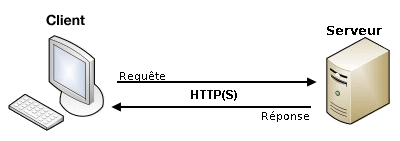
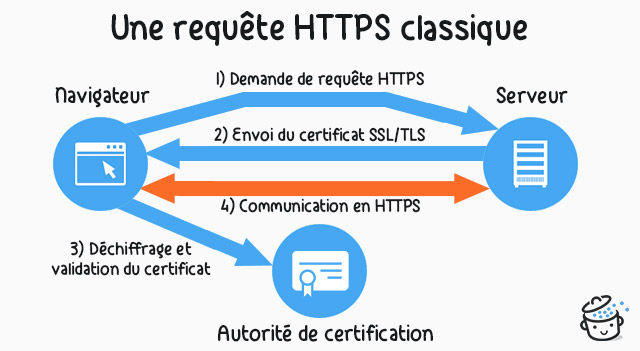
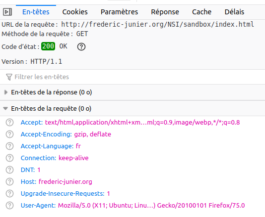
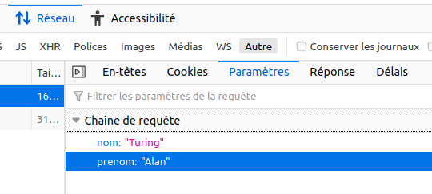

---
title : HTTP le protocole du Web
author : Première NSI Lycée du Parc
numbersections: true
fontsize: 11pt
geometry:
- top=20mm
- left=20mm
- right=20mm
- heightrounded    
--- 
 
# Crédits {-} 
 
_Ce cours est largement inspiré du chapitre 28 du manuel NSI de la collection Tortue chez Ellipsen auteurs : Ballabonski, Conchon, Filliatre, N'Guyen._
      
# Le Web 

<!-- Définition des hyperliens  -->

[URL]: https://developer.mozilla.org/fr/docs/Glossaire/URL

[HTTP]: https://developer.mozilla.org/fr/docs/Glossaire/HTTP

[HTML]: https://developer.mozilla.org/fr/docs/Glossaire/HTML

[Tim Berners-Lee]: https://interstices.info/les-debuts-du-web-sous-loeil-du-w3c/

[Robert Caillau]: https://fr.wikipedia.org/wiki/Robert_Cailliau

[CERN]: https://fr.wikipedia.org/wiki/Organisation_europ%C3%A9enne_pour_la_recherche_nucl%C3%A9aire 

[IETF]: https://developer.mozilla.org/fr/docs/Glossaire/IETF

[TCP]: https://developer.mozilla.org/fr/docs/Glossaire/TCP

[IP]: https://developer.mozilla.org/fr/docs/Glossaire/IP_Address

[Javascript]: https://developer.mozilla.org/fr/docs/Glossaire/JavaScript

[CSS]: https://developer.mozilla.org/fr/docs/Glossaire/CSS

[DNS]: https://developer.mozilla.org/fr/docs/Glossaire/DNS  

[HTTPS]: https://developer.mozilla.org/fr/docs/Glossaire/https

[PHP]: https://developer.mozilla.org/fr/docs/Glossaire/PHP

[Python]: https://docs.python.org/3.7/library/cgi.html

[POST]: https://developer.mozilla.org/fr/docs/Web/HTTP/M%C3%A9thode/POST

[GET]: https://developer.mozilla.org/fr/docs/Web/HTTP/M%C3%A9thode/GET

[certificat]: https://developer.mozilla.org/fr/docs/Glossaire/Certificat_num%C3%A9rique

## Les trois piliers du Web : HTTP, URL et HTML

Le Web est une application du réseau Internet qui  désigne un réseau de sources d'information reliées par des liens hypertextes. Le Web fonctionne selon __l'architecture client/serveur__  : la machine _client_ demande à la machine _serveur_ une ressource identifiée par son adresse [URL][URL]. Aux débuts du Web le client était commandé par un humain mais ce peut être un programme.

:::center
{width=60%}
:::

Les inventeurs  du Web, [Tim Berners-Lee][Tim Berners-Lee]  et [Robert Caillau][Robert Caillau] ont défini au [CERN][CERN]  entre 1989 et 1991 ses trois piliers  [HTTP][http], [URL](URL) et [HTML](HTML).

:::cours

* Dans un échange sur le  Web, le  __client__  envoie une demande ou __requête__  à l'aide d'un logiciel appelé __navigateur__ ^[Note : Ne pas confondre navigateurs comme Firefox, Edge, Chrome et moteurs de recherche comme Qwant, Google search, Bing] : le __serveur__ est un logiciel installé sur une machine reliée en réseau à la machine du client.
* Le protocole [HTTP][HTTP], acronyme d'`Hypertext Transfer Protocol`, est un protocole de la couche application qui décrit le format des échanges de données entre un client et un serveur sur le Web. Un échange HTTP s'établit selon le schéma suivant :
  * Le client saisit une [URL][URL] dans la barre d'adresse du navigateur, elle est résolue en adresse [IP][IP] par le service [DNS][DNS].
  * Mise en place d'une connexion [TCP](TCP) entre le client et le serveur.
  * Le client envoie une requête [HTTP][HTTP] (format texte lisible par un humain).
  * Le serveur retourne une réponse [HTTP][HTTP], lue par le  client. S'il y a un contenu, il est affiché par le navigateur du client.
  * Fermeture ou réutilisation (paramètre `Keep-alive`) de la connexion pour les requêtes suivantes.

Le protocole [HTTP][HTTP] n'est pas sécurisé par défaut, il peut l'être par l'ajout du protocole SSL ou TLS et on désigne par [HTTPS][HTTPS] sa version sécurisée. [HTTP][HTTP] est un standard normalisé par l'[IETF][IETF] comme les protocoles d'internet [TCP][TCP] et [IP][IP].
  
<!-- \ -->

{width=50%}\
_Source : [https://developer.mozilla.org/fr/docs/Web/HTTP/Aper%C3%A7u](https://developer.mozilla.org/fr/docs/Web/HTTP/Aper%C3%A7u)_

* Une adresse [URL][URL] pour `Uniform Ressource Locator` identifie une ressource sur le Web. La syntaxe des [URL][URL] est standardisée, par exemple décomposons :   
   [https://www.gnu.org/gnu/linux-and-gnu.fr.html](https://www.gnu.org/gnu/linux-and-gnu.fr.html) :
  * le protocole est `https` ;
  * le nom de domaine sur Internet du serveur Web  est `gnu.org`.  
    `www.gnu.org` est un sous-domaine servant d'alias pour le dossier public du serveur ;
  * `gnu/linux-and-gnu.fr.html` est le chemin vers la ressource sur le serveur : le fichier `linux-and-gnu.fr.html` qui se trouve dans le dossier public `gnu`.
* [HTML][HTML] pour `Hypertext Markup Language`  est le langage de description des documents textes disponibles sur le Web qui sont reliées entre eux par des   liens hypertextes. Il s'agit d'un langage à balises. 
En pratique, d'autres types de  ressources sont accessibles sur le Web par une [URL][URL] : des images, des fichiers de données (aux formats CSV, JSON ...), des videos ... Par ailleurs les pages sont désormais réalisées en combinant [HTML][HTML] avec [CSS][CSS] pour la mise en forme, le positionnement, certains effets visuels et  [Javascript][Javascript] pour la programmation événementielle nécessaire à l'interactivité côté client.

{width=100%}\

_Source :_ https://developer.mozilla.org/fr/docs/Glossaire/HTML
:::

:::exercice

_QCM_ de type E3C2.

Pour répondre à la première question, relisez la [synthèse de cours sur HTML/CSS](https://parc-nsi.github.io/premiere-nsi/chapitre2/memo/MemoHTML-CSS-2020.pdf).

1. Quelle est le code HTML permettant de créer un lien hypertexte dans un document écrit en [HTML][HTML] ?
   * Réponse A :  `<a\>http://tip-top.fr </a>`
   * Réponse B : `<a href="http://tip-top.fr">Site du TIP-TOP</a>`
   * Réponse C :  `<a name="http://tip.top.fr</a>` 

2. Comment s\'appelle le service qui permet de faire le lien entre une IP et un nom de domaine ?
   * Réponse A :  DNS
   * Réponse B : ARP
   * Réponse C : HTTP
   * Réponse D : Internet
:::

:::exercice

{width=50%}\
_Source : [https://developer.mozilla.org/fr/docs/Web/HTTP/Aper%C3%A7u](https://developer.mozilla.org/fr/docs/Web/HTTP/Aper%C3%A7u)_

1. Avec un navigateur Web, demander la page  d'adresse   
    [http://frederic-junier.org/NSI/sandbox/index.html](http://frederic-junier.org/NSI/sandbox/index.html).  
    Ouvrir la barre d'outils de développement en appuyant sur la touche de fonction `F12` et sélectionner l'onglet Réseau. On peut voir les entêtes de la requête et de la réponse HTTP.

   *  Que représente  le code d'état de la réponse HTTP ?
   *  Quelles informations sur le client sont transmises au serveur dans l'entête de la requête ?
   *  Quelles informations sur le serveur sont transmises au client dans l'entête de la réponse ?
   *  Effectuer une nouvelle requête avec l'[URL][URL] [http://frederic-junier.org/NSI/sandbox/](http://frederic-junier.org/NSI/sandbox/). Quelle différence avec la requête initiale ?
   *  Effectuer une nouvelle requête avec l'[URL][URL] [https://frederic-junier.org/NSI/sandbox/](https://frederic-junier.org/NSI/sandbox/). Quelle différence avec la requête initiale peut-on observer dans la barre d'adresse du navigateur  ?
   *  Effectuer une nouvelle requête avec l'[URL][URL] [http://frederic-junier.org/NSI/Sandbox/index.html](http://frederic-junier.org/NSI/Sandbox/index.html). Quel est le code d'état de la réponse ? Explication ?
   *  Effectuer une nouvelle requête avec l'[URL][URL] [http://frederic-junier.org/NSI/interdit](http://frederic-junier.org/NSI/interdit). Quel est le code d'état de la réponse ? Explication ?

2. Le site [https://httpie.org/](https://httpie.org/) propose un client HTTP en ligne de commandes permettant de décomposer les requêtes HTTP en précisant la méthode et l'URL de la ressource demandée. 
   * Ouvrir la page [https://httpie.org/run](https://httpie.org/run) 
   * Saisir la commande `http -v GET https://frederic-junier.org/NSI/sandbox/index.html`. Décrire le fonctionnement de la méthode `GET` du protocole `HTTP` : formats de la requête et de la réponse.
   * Saisir la commande `http -v HEAD https://frederic-junier.org/NSI/sandbox/index.html`. Décrire le fonctionnement de la méthode `HEAD` du protocole `HTTP` : formats de la requête et de la réponse.
   * Saisir la commande `http -v PUT https://frederic-junier.org/NSI/sandbox/index.html hello=world`. Quel résultat obtient-on ?  Explication ^[Note : Méthodes HTTP : voir [https://developer.mozilla.org/fr/docs/Web/HTTP/M%C3%A9thode](https://developer.mozilla.org/fr/docs/Web/HTTP/M%C3%A9thode)] ?

{width=50%}\

:::

## Passage de paramètres dans une URL

:::exercice

Ouvrir un navigateur Web.

1. Demander la page  d'adresse [http://frederic-junier.org/NSI/sandbox/accueil.php](https://frederic-junier.org/NSI/sandbox/accueil.php)  

    Quel est l'affichage obtenu ?
   
2. Demander la page  d'adresse  
[http://frederic-junier.org/NSI/sandbox/accueil.php?nom=Turing&prenom=Alan](https://frederic-junier.org/NSI/sandbox/accueil.php?nom=Turing&prenom=Alan)  

    Quel est l'affichage obtenu ? Ouvrir les outils de développement avec `F12` puis sélectionner les onglets `Réseau`  et `Paramètres`. 

    __La partie `?nom=Turing&prenom=Alan` de l'[URL][URL] est une _chaîne de requête_, elle commence par le symbole `?` puis contient une liste de paires `nom=valeur` séparées par un symbole esperluette `&`. Ces paramètres ne font pas partie de l'adresse de la ressource mais sont une façon pour le client de transmettre des informations au serveur.__

    {width=50%}\
 
3. Remplacer Turing par votre nom et Alan par votre prénom dans l'[URL][URL] précédente. Que peut-on remarquer ? À votre avis, que se passe-t-il sur le serveur lorsqu'il reçoit la requête HTTP ? 
4. Voici le contenu du fichier `accueil.php` sur le serveur. S'agit-il d'un texte écrit   en  [HTML][HTML] ? Faire une recherche sur la signification de l'acronyme [PHP][PHP].

~~~php
 <!DOCTYPE html>
<html lang="fr">
<head>
  <title>Accueil </title>
  <meta charset="utf-8">    
</head> 
<body>
<h1>
<?php  
echo "Bienvenue " . $_GET['prenom'] . " " .  $_GET['nom'] ;
?>
</h1>
</body>
</html> 
~~~

4. Enregistrer l'[URL][URL] testée précédemment  dans les marque-pages du navigateur. Ouvrir un autre onglet et cliquer sur le signet enregistré. Retrouve-t-on la même page Web ?
:::

# Formulaire et passage de paramètres

## Un premier exemple

:::exemple

1. Ouvrir avec un navigateur Web la page d'[URL][URL] :

   [http://frederic-junier.org/NSI/sandbox/formulaire-get.html](http://frederic-junier.org/NSI/sandbox/formulaire-get.html)

   \

   * Cliquer sur le bouton `Envoyer`. Que se passe-t-il ? Rafraîchir la page avec `F5`. Que se passe-t-il ?
   * Changer les valeurs des champs `Prénom` et `Nom` du formulaire puis cliquer sur le bouton `Envoyer`. Que se passe-t-il ?
   * Ouvrir la fenêtre des outils de développement et afficher dans l'onglet Réseau l'entête de la requête HTTP qui devrait ressembler à celui-ci :
   
   {width=80%}\

   Sélectionner l'onglet Paramètres et vérifier qu'on obtient les paramètres transmis à travers l'[URL][URL] dans la chaîne de requête comme dans l'exercice 3.

   * Afficher le code source de la page `formulaire-get.html` avec le raccourci clavier `CRTL + U`. On devrait obtenir le texte ci-dessous :
 
   ~~~html
   <!DOCTYPE html>

   <html lang="fr">

   <head>
   <title>Formulaire HTML </title>
   <meta charset="utf-8">    
   </head> 
   <body>

      <form action = "accueil.php" method="GET">        
         <label for="id_prenom">Prénom :</label>
         <input type="text" id="id_prenom" name="prenom" value="Alan">
         <label for="id_nom">Nom :</label>
         <input type="text" id="id_nom" name="nom" value="Turing">
         <button type="submit" id="bouton">Envoyer</button>
      </form>

   </body>
   </html> 
   ~~~

2. Ouvrir avec un navigateur Web la page d'[URL][URL] :

   [http://frederic-junier.org/NSI/sandbox/formulaire-post.html](http://frederic-junier.org/NSI/sandbox/formulaire-post.html)

   * Cliquer sur le bouton `Envoyer`. Que se passe-t-il ?
   * Changer les valeurs des champs `Prénom` et `Nom` du formulaire puis cliquer sur le bouton `Envoyer`. Que se passe-t-il ? Observe-t-on  un changement dans l'[URL][URL] de la requête ? dans son entête ?
   * Rafraîchir la  page avec `F5`. Que se passe-t-il ?

   {width=70%}\

   * Ouvrir la fenêtre des outils de développement et afficher dans l'onglet Réseau l'entête de la requête HTTP qui devrait ressembler à celui-ci :

   {width=60%}\

   Sélectionner l'onglet Paramètres et vérifier qu'on retrouve  les paramètres transmis dans l'[URL][URL]. Quelle différence par rapport à la méthode vue en question 1 ? 

   {width=40%}\

   * Afficher le code source de la page `formulaire-post.html`  avec le raccourci clavier `CRTL + U`.
   Quels sont  les  deux changements par rapport au code  de `formulaire-get.html` ?

:::

## Méthodes de passage des paramètres : GET ou POST

:::cours

En [HTML][HTML], un formulaire est un élément qui permet de transmettre des informations à un serveur Web. Il est composé d'un élément `<form action="http://domaine/cible" method="GET" >`
qui contient un ou plusieurs widgets, des éléments [HTML][HTML] permettant de saisir les entrées du client et au moins un élément `<button type="submit>Bouton d'envoi</button>`. Un clic sur ce dernier déclenche l'exécution d'une requête [HTTP][HTTP] qui va transmettre les données saisies selon les valeurs des attributs `action` et `method` de l'élément `<form>` :

* `action` a pour  valeur l'[URL][URL] du fichier auquel sera envoyé le formulaire. Ce fichier est un programme écrit dans un langage de script comme [PHP][PHP] ou [Python][Python], qui  va prendre en entrée les paramètres du formulaire transmis par le client, les traiter et générer la page Web en [HTML][HTML] qui lui sera renvoyée.
* `method` peut prendre deux valeurs [GET][GET] ou [POST][POST] (en minuscule ou majuscule), ce sont les deux modes de transmission des paramètres du formulaire qui sont deux méthodes distinctes du protocole [HTTP][HTTP] :
  * avec la méthode [GET][GET] , les données du formulaire sont assemblées dans une chaîne  de paires `nom=valeur` séparées par le symbole `&` qui est ajouté à la fin de l'[URL][URL] après  le délimiteur `?`.
  * avec la méthode [POST][POST] les données du formulaire sont transmises toujours dans le corps de la requête. Les données n'apparaissent donc pas dans l'[URL][URL].

{width=80%}\

Le formulaire du fichier `formulaire-get.html` de l'exemple 1 contient deux  widgets `<input>`. Chacun va fournir un couple `nom=valeur`, le nom est désigné par l'attribut `name` et la valeur par le texte saisi  dans   l'élément `<input>`.  Chacun est associé par son attribut  `id`   à une étiquette contenue dans un élément `<label>`.

Caractéristiques de la méthode [GET][GET] : 

* Toutes les informations transmises, le sont en clair dans l'[URL][URL]. Celle-ci est limitée en taille donc  la méthode [GET][GET]  ne peut pas être utilisée pour transmettre des informations trop longues.
* Une requête  [GET][GET] est constituée uniquement d'un entête, elle n'a pas de corps.
* Elle ne modifie pas l'état du serveur, elle est utilisée uniquement pour demander une ressource. Un exemple classique d'utilisation est la formulation d'une requête à l'aide du formulaire d'un moteur de recherche.  L'[URL][URL] générée peut être utilisée plusieurs fois et conservée comme marque-page.

Caractéristiques de la méthode [POST][POST] : 

* Les données sont transmises   dans le corps de la requête, il n'y a pas de restriction de taille. Elles peuvent être de tout type : url-encodées (chaîne de paires `nom=valeur`), ou binaires. C'est précisé dans le champ `Content-type` de l'entête comme pour une réponse [HTTP][HTTP].
* Les données  n'apparaissent pas dans l'[URL][URL], néanmoins, si le protocole [HTTP][HTTP] est employé sans chiffrement, il suffit d'intercepter la requête pour accéder aux données en clair.
* Les données envoyées  peuvent modifier l'état du serveur. Par exemple, les requêtes [POST][POST] sont utilisées pour les modifications de bases de données sur le serveur (achats, réservation, transfert de fichiers ...). Par conséquent si on veut renvoyer les données d'un formulaire, un message en popup avertit que ce nouvel envoi peut modifier l'état du serveur et par exemple d'enregistrer un nouvel achat s'il s'agit d'un formulaire de commande.
:::

:::exercice

_QCM_ de type E3C2.

1. Parmi les réponses suivantes, que permet d'effectuer la méthode [POST][POST] du protocole [HTTP][HTTP] ?

   * Réponse A :  Définir le style d'une page web
   * Réponse B : Pirater des données bancaire
   * Réponse C :  Envoyer une page web vers le client
   * Réponse D :  Envoyer les données saisies dans un formulaire HTML vers un serveur

2. Un site internet utilise une requête [HTTP][HTTP] avec la méthode [POST][POST] pour transmettre les données d'un formulaire. Laquelle des affirmations suivantes est **incorrecte** ?

   * Réponse A : les données envoyées ne sont pas visibles
   * Réponse B : il est possible de transmettre des données de type binaire
   * Réponse C :  les données transmises sont cryptées
   * Réponse D :  il n'y a pas de restriction de longueur pour les données transmises

3. Un internaute clique sur un lien qui envoie la requête [HTTP][HTTP] suivante à un serveur :

   `http://jaimelaneige.com/ma_planche/traitement.php?nom=Snow&prenom=Jon`

   Que demande cette requête au serveur ?

   * Réponse A :  de renvoyer le fichier traitement.php en identifiant nom et prénom à Snow et Jon
   * Réponse B : d'exécuter le fichier traitement.php en identifiant nom et prénom à Snow et Jon
   * Réponse C :  d'indiquer si Jon Snow a bien pris son traitement
   * Réponse D : de renvoyer le fichier traitement.php en affichant prénom et nom : Jon
:::

## Eléments de formulaire

:::cours

1. Le principal élément  permettant la saisie de données dans un  champ de formulaire [HTML][HTML] est `<input>`. Son attribut `type` permet de vérifier que les données saisies correspondent au type attendu.

   Type | Exemple de syntaxe 
   :---|:---
   Texte | `<input type="text"  name="t"  value="Défaut">` 
   Email | `<input type="email"  name="a"  value="defaut@defaut.fr">` 
   Nombre | `<input type="number"  name="n"  value="1" min="0" max="10">` 
   Mot de passe | `<input type="password"   name="pwd">` 
   Cases à cocher  | `<input type="checkbox"  name="carrots"  value="carrots">`
   Bouton radio (choix exclusif) | `<input type="radio"  value="soup"  name="meal">` 
  

2. L'élément `<textarea>`  permet de saisir un texte de longueur arbitraire et `<select>` permet de définir une liste déroulante.
3. Le bouton de soumission d'un formulaire est représenté par un élément de la forme `<button type="submit">Envoyer</button>`.

La page [https://developer.mozilla.org/fr/docs/Web/Guide/HTML/Formulaires/Les_blocs_de_formulaires_natifs](https://developer.mozilla.org/fr/docs/Web/Guide/HTML/Formulaires/Les_blocs_de_formulaires_natifs) décrit les principaux widgets de formulaire et la page [https://www.w3schools.com/html/html_form_elements.asp](https://www.w3schools.com/html/html_form_elements.asp) permet de les tester.
:::

:::exercice

1. Ouvrir dans un navigateur Web la page dont l'[URL][URL] est  :  
   <https://repl.it/@fredericjunier/NSI-formulaire-exo5-radio>.
   * Cliquer sur `RUN` pour lancer le serveur, remplir le formulaire contenu dans le fichier `index.php` et envoyer les données. Quelle méthode est utilisée pour le passage des paramètres du formulaire ?
   * Modifier les codes sources des fichiers `index.php` et `navigateur.php` pour changer  la méthode de passage   des paramètres du formulaire. En [PHP][PHP], on récupère la valeur du paramètre `nom` avec `$_GET['nom']` si la méthode est [GET][GET] ou  `$_POST['nom']` si c'est [POST][POST].
   * Consulter la  documentation sur l'élément  de formulaire `<select>` contenue dans la page [https://www.w3schools.com/html/html_form_elements.asp](https://www.w3schools.com/html/html_form_elements.asp) et remplacer les `<input>` de type `radio` du formulaire dans `index.php` par un élément `<select>`  avec choix unique.

2. Ouvrir dans un navigateur Web la page dont l'[URL][URL] est :  
   <https://repl.it/@fredericjunier/NSI-formulaire-exo5-checkbox>.
   * Cliquer sur `RUN` pour lancer le serveur, remplir le formulaire contenu dans le fichier `index.php` et envoyer les données. Quelle méthode est utilisée pour le passage des paramètres du formulaire ?
   * Modifier les codes sources des fichiers `index.php` et `langages.php` pour changer  la méthode de passage   des paramètres du formulaire.
   * Consulter la  documentation sur l'élément  de formulaire `<select>` contenue dans la page [https://www.w3schools.com/html/html_form_elements.asp](https://www.w3schools.com/html/html_form_elements.asp) et remplacer les `<input>` de type `checkbox` du formulaire dans `index.php` par un élément `<select>`  avec choix multiple. Pour modifier le code [PHP](PHP) on s'inspirera de ce [post stackoverflow](https://stackoverflow.com/questions/2407284/how-to-get-multiple-selected-values-of-select-box-in-php/2407401#2407401).

3. Ouvrir dans un navigateur Web la page dont l'[URL][URL] est :  
   <http://frederic-junier.org/NSI/sandbox/NSI-formulaire-exo5-login-get.html>.
   * La page présente un formulaire basique de connexion avec deux champs  `login` et `password`. La valeur de l'identifiant est libre et le mot de passe est `secret`. Remplir  le formulaire et envoyer les données. Quelle méthode de passage des paramètres est utilisée ? La transmission du mot de passe est-elle satisfaisante ?
   * Revenir sur la page du formulaire, ouvrir la fenêtre des outils de développement avec `F12` et modifier le code source pour que l'envoi du mot de passe soit sécurisé.
   
   {width=60%}\

   * Dans le schéma ci-dessous d'un échange Web sécurisé avec le protocole  [HTTPS][HTTPS], apparaît la notion de [certificat][certificat]. Quel est le rôle d'un [certificat][certificat] et comment est-il géré par le navigateur ?
  
   {width=87%}\

   _Source : [https://blog.octo.com/bd-le-https/](https://blog.octo.com/bd-le-https/)_
:::